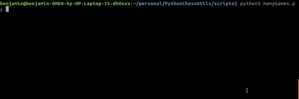

# PythonChessUtils

## Demonstration:

### Currently Supports:
 - Analyzing games via PGN, Lichess API, chess.game(), and more
 - High-speed ACPL calculations
 - Lichess performance analysis

### TODO:
 - Automated annotations of games for Arena, Chessbase, etc.
 - Exporting to Lichess

### To use:
`pip install -r requirements.txt`  
`python3 scripts/<desiredScript.py>`  

